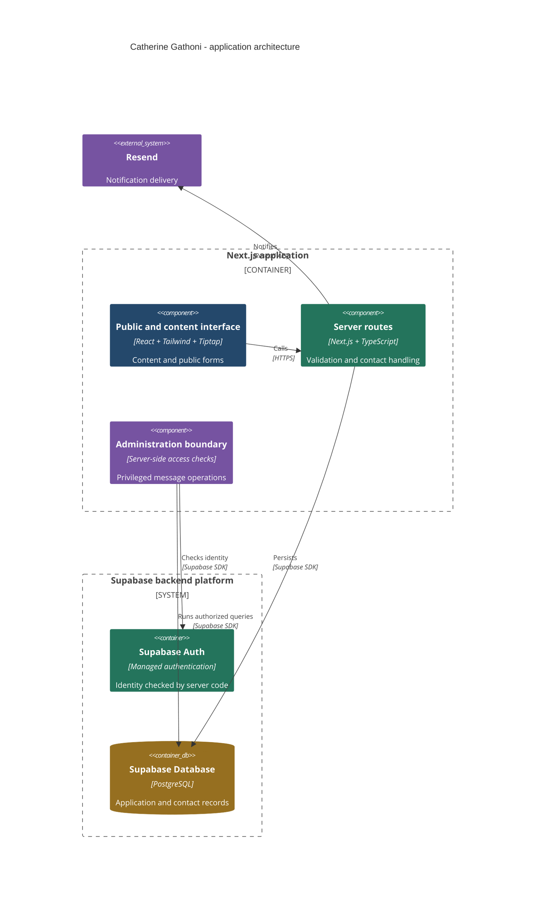

# Catherine Gathoni

### Content, public forms, and a separate administration boundary

[Lawi Mwaura](https://github.com/Lawi-Mwaura) · [Public preview](https://catherine-six.vercel.app)

*Actual public preview captured on 1 October 2026. No dashboard records or customer submissions are shown.*

## Problem statement

Public contact and content journeys need validation, while administrative records require privileged access checks. A notification failure should not erase a successfully saved submission.

## Technologies used

TypeScript · Next.js · React · Tailwind CSS · Supabase · Resend · Tiptap · Zod · Sentry

## Engineering scope

A Next.js website with editorial content, public contact and subscription journeys, and administrative workflows. The active application is separated from alternate deployment and design-handoff artifacts in the source repository.

**Technologies:** TypeScript, Next.js, React, Tailwind CSS, Supabase, Resend, Tiptap, Zod, Sentry.

## System design

**Component architecture.** The boxes identify technologies and responsibilities; boundaries group the application runtime and managed backend. Relationships show dependencies and integration protocols, rather than a step-by-step processing flow.

*Simplified responsibility map. Internal entities, credentials, and deployment details are omitted.*

| Concern | Implementation reviewed |
| :--- | :--- |
| Untrusted input | Contact handling trims text, normalizes email, and rejects missing or invalid required fields. |
| Email rendering | Submitted text is escaped before insertion into the contact notification’s HTML. |
| Partial failure | Contact persistence is evaluated before notification delivery; notification errors are reported separately. |
| Administrative access | Dashboard message handlers call a server-side administrator check before reading or changing records. |
| Query bounds | Dashboard lists use pagination rather than returning an unrestricted collection. |
| Operational visibility | Error reporting distinguishes submission, notification, and administrative loading failures. |

## Challenges and tradeoffs

**Persistence and notification have different outcomes.** A saved enquiry should remain saved if a notification fails. The contact route records the submission first and handles notification failure separately. Durable retry handling and delivery monitoring are separate operational questions; this overview does not claim guaranteed email delivery.

**Public forms and administrative operations have different trust levels.** An administration screen alone cannot protect data. Its server routes must evaluate administrative access before making privileged queries. The reviewed message handlers put that check ahead of the operation.

**Rich content brings additional responsibilities.** An editor improves authoring, but content rendering, attachments, and preview behavior need explicit validation. The public showcase does not expose the administrative interface or its records.

## Outcomes

- Contact handling normalizes and validates input and escapes submitted text in notification HTML.
- Persistence and notification results are handled separately.
- Reviewed administrative message routes check access before querying or mutating records.
- Paginated lists bound administrative queries.

These are implementation outcomes supported by the reviewed source, not measured production improvements.

## Metrics and evidence

| Measure | Evidence |
| :--- | :--- |
| Interface evidence | Public web interface captured on 1 October 2026. |
| Verification scope | Source responsibilities reviewed; no complete build, live submission, or administration audit performed. |
| Production metrics | No verified traffic, conversion, latency, or reliability figures supplied. |

## Validation scope

This documentation update reviewed source responsibilities and captured the public interface. It did not execute a complete application build, submit live forms, or perform an end-to-end administration or security audit. Further verification should exercise malformed input, notification failure after persistence, and unauthorized administrative requests.

Source remains private. This repository contains only public interface captures and an engineering overview.

[Contact Lawi](mailto:lawimwaura@gmail.com)
